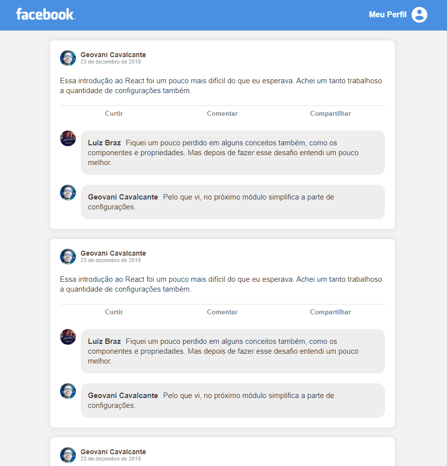

<h1 align="center">
    
</h1>

<h3>
  Desafio 4: Introdução ao React
</h3>

Criação de uma aplicação do zero utilizando Webpack, Babel, Webpack Dev Server e ReactJS.
Nessa aplicação foi desenvolvida uma interface semelhante com a do Facebook utilizando React.
As informações contidas na interface são estáticas e não refletem nenhuma API REST ou back-end.

<h1 align="center">
    
</h1>

## :rocket: Tecnologias

Esse projeto foi desenvolvido no Bootcamp GoStack da Rocketseat com as seguintes tecnologias:

-  ReactJS
-  Webpack
-  Babel 
-  Webpack Dev Server
-  CSS Flexbox

## :information_source: Como executar este projeto

```bash
# Clone este repositório
$ git clone https://github.com/geovanicv/facebook-interface

# Navegue até a pasta
$ cd facebook-interface

# Instale as dependências
$ yarn

# Execute o app
$ yarn dev
```
